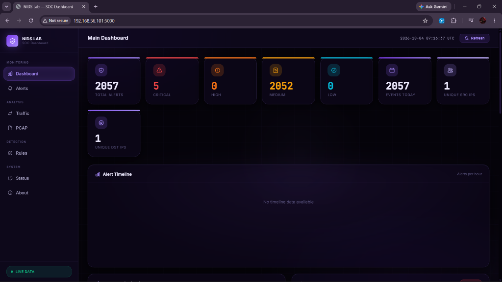
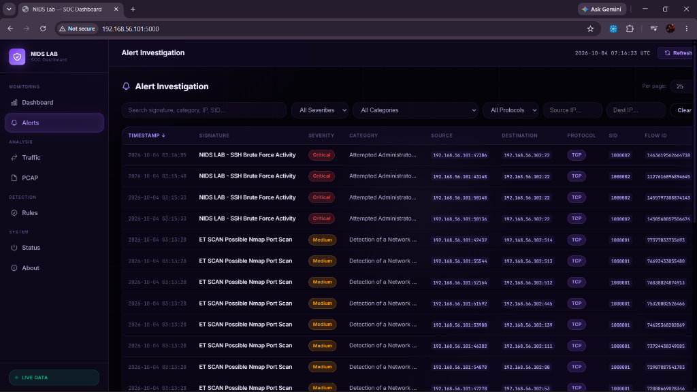
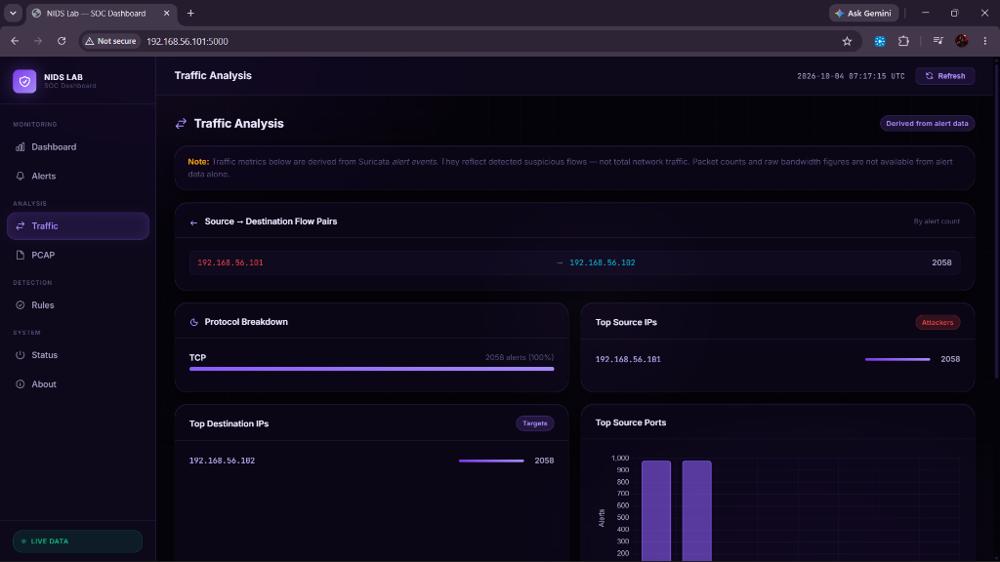
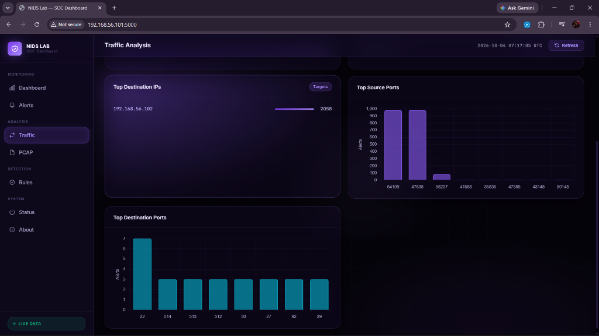

# Network Intrusion Detection Lab

A hands-on passive NIDS/SOC simulation for detecting and visualizing network reconnaissance and SSH attack activity using Suricata and Flask.

## Dashboard Preview

The Flask-based SOC dashboard visualizes detected network security events and provides a centralized view of Suricata-generated alerts in near-real time. It highlights key security indicators including total alerts, severity classifications, unique source/destination IPs, alert distribution timelines, and a live alert event feed.



## What We Built

This project integrates attack generation, passive network monitoring, rule-based detection, event ingestion, and SOC-style visualization into a reproducible cybersecurity lab.

## Key Features

- Passive Network Intrusion Detection
- Suricata-based detection
- Nmap reconnaissance detection
- SSH attack detection
- Flask SOC-style dashboard
- Wireshark network analysis
- Reproducible cybersecurity lab environment

---

# Table of Contents

1. [Project Overview](#1-project-overview)
2. [Problem Statement](#2-problem-statement)
3. [Project Objectives](#3-project-objectives)
4. [Real-World Concept & Scope](#4-real-world-concept--scope)
5. [System Architecture](#5-system-architecture)
   - [Quick Start — Final Demo](#quick-start--final-demo)
6. [Data Flow Pipeline](#6-data-flow-pipeline)
7. [Component Roles](#7-component-roles)
8. [Network Topology](#8-network-topology)
9. [Technology Stack](#9-technology-stack)
10. [Repository Structure](#10-repository-structure)
11. [Hardware & Software Prerequisites](#11-hardware--software-prerequisites)
12. [Initial Project Setup](#12-initial-project-setup)
13. [Suricata Configuration & Rules](#13-suricata-configuration--rules)
14. [Safe Clean Start Procedure](#14-safe-clean-start-procedure)
15. [Starting the Suricata Sensor](#15-starting-the-suricata-sensor)
16. [Starting the Flask Dashboard](#16-starting-the-flask-dashboard)
17. [Accessing the Dashboard](#17-accessing-the-dashboard)
18. [Live Dashboard Polling Mechanism](#18-live-dashboard-polling-mechanism)
19. [Reproducible Attack & Detection Tests](#19-reproducible-attack--detection-tests)
20. [Test Results Matrix](#20-test-results-matrix)
21. [End-to-End Pipeline Verification](#21-end-to-end-pipeline-verification)
22. [Traffic Investigation with Wireshark](#22-traffic-investigation-with-wireshark)
23. [Backend API Reference](#23-backend-api-reference)
24. [Automated Software Testing](#24-automated-software-testing)
25. [Troubleshooting Guide](#25-troubleshooting-guide)
26. [Safe Clean Shutdown Procedure](#26-safe-clean-shutdown-procedure)
27. [Final Presentation Checklist](#27-final-presentation-checklist)
28. [Project Limitations](#28-project-limitations)
29. [Future Improvements](#29-future-improvements)
30. [Team Contributions](#30-team-contributions)
31. [Security & Ethical Notice](#31-security--ethical-notice)
32. [GitHub Usage & Version Control](#32-github-usage--version-control)
33. [Final Project Statement](#33-final-project-statement)

---

# 1. Project Overview

The **Network Intrusion Detection Lab** is an educational, virtualized cybersecurity engineering project designed to simulate how enterprise intrusion detection sensors capture, process, and present security events to analysts in a Security Operations Center (SOC).

The lab environment couples an attacker machine, an intentionally vulnerable victim server, an open-source passive Network Intrusion Detection System (Suricata), and an analyst dashboard developed with Flask and vanilla web technologies.

```text
Kali
  ├── Nmap / Hydra
  ├── Suricata observing eth1
  └── Flask Dashboard
        |
        v
Host-Only Network
        |
        v
Metasploitable2
```

Suricata passively observes traffic on Kali's eth1 interface.

---

# 2. Problem Statement

Modern enterprise networks transmit millions of raw network packets every minute. Interpreting raw packets or reading gigabytes of PCAP files manually during an active incident is impractical for security operations teams. 

Security analysts require:
1. **Automated Inspection:** Passive network sensors that inspect packet headers and payloads at line rate without introducing latency or disrupting host communication.
2. **Signature Evaluation:** Deterministic rule engines that flag suspicious behavioral indicators, such as rapid SYN sweeps or repeated authentication attempts.
3. **Structured Event Logging:** Standardized serialization (such as Suricata's Extensible Event Format, `eve.json`) that records alert metadata, flow identifiers, protocol details, and timestamps.
4. **Visual Monitoring & Triaging:** Centralized SOC monitoring dashboards that aggregate, sort, filter, and track alert timelines in near-real time.

This project addresses this challenge by deploying a self-contained, reproducible simulation of this complete detection and monitoring pipeline inside an isolated virtual lab environment.

---

# 3. Project Objectives

The core objectives of the project are:

* **Generate Controlled Attack Traffic:** Execute repeatable TCP SYN reconnaissance scans and automated SSH authentication attempts against an isolated target.
* **Observe Packet-Level Activity:** Sniff live frames traversing a dedicated Host-Only virtual interface (`eth1`).
* **Implement Custom Detection Signatures:** Author and deploy targeted Suricata rules with stateful threshold filters (`detection_filter`) to capture suspicious traffic bursts.
* **Emit Structured Telemetry:** Output granular alert records in JSON format via Suricata's `eve.json`.
* **Build an Ingestion Backend:** Develop a lightweight Python/Flask backend capable of parsing new lines incrementally without restarting the service.
* **Expose Standard REST APIs:** Implement query endpoints for alert pagination, severity breakdown, top source/destination IPs, protocol distributions, and system component status.
* **Deliver a SOC-Style Dashboard:** Present analyst-friendly interfaces featuring KPI metrics, dynamic Chart.js charts, searchable alert tables, and raw JSON modal views.
* **Implement Near-Real-Time Updates:** Keep the dashboard synchronized with active sensor output via periodic 3-second client polling.
* **Enable Forensic Investigation:** Complement automated NIDS alerts with packet-level inspection using Wireshark.
* **Ensure Full Reproducibility:** Document an exact, copy-paste-ready procedure allowing independent reproduction from scratch.

---

# 4. Real-World Concept & Scope

### Enterprise Analogy

In a commercial Security Operations Center, a passive tap or SPAN/mirror port on a network switch duplicates physical traffic to an out-of-band NIDS appliance:

```text
Production Switch Traffic (SPAN / Mirror Port)
                     |
                     v
             NIDS Sensor Appliance (Passive Sniffer)
                     |
                     v
             Rule Matching & Protocol Decoders
                     |
                     v
             Structured Log Feed (Syslog / JSON / Kafka)
                     |
                     v
             SIEM / Data Lake Ingestion
                     |
                     v
             SOC Analyst Dashboard / Monitoring Console
```

Our laboratory implements a micro-scale, faithful software model of this pipeline:

```text
Kali Host-Only Virtual Interface (eth1)
                     |
                     v
             Suricata Daemon (Passive IDS Mode)
                     |
                     v
             Custom Rules (nids-lab.rules)
                     |
                     v
             /var/log/suricata/eve.json
                     |
                     v
             Flask Backend Service (parser.py & store.py)
                     |
                     v
             Single-Page Web Application (app.js & style.css)
```

### What the Project IS
* A **passive Network Intrusion Detection System (NIDS)** simulation.
* An educational, isolated virtual network monitoring laboratory.
* A demonstration of deterministic, signature-based rule evaluation with rate thresholds.
* A complete logging, API parsing, and SOC-style visual triaging workflow.

### What the Project IS NOT
* **Not an IPS (Intrusion Prevention System):** It does not operate inline; it does not drop packets, reset TCP connections, or dynamically alter firewall rules (`iptables`/`nftables`).
* **Not a Commercial SIEM / SOAR:** It does not integrate external threat feeds, execute automated playbooks, or index terabytes of distributed logs.
* **Not a Network Detection & Response (NDR) Appliance:** It does not use proprietary hardware acceleration or deep flow telemetry across multiple routers.
* **Not an AI/ML Engine:** Detections are strictly deterministic and rule-driven. No statistical machine learning or behavioral anomaly scoring models are used.

---

# 5. System Architecture

The following diagram illustrates the deployment topology, process boundaries, and data paths:

```text
                         WINDOWS HOST
                    Browser / Project Demo
                              |
                              | HTTP (Port 5000)
                              v
+------------------------------------------------------------------+
| KALI LINUX VM (192.168.56.101)                                   |
|                                                                  |
|  +----------------+       +------------------------------------+ |
|  | Nmap / Hydra   | ----> | eth1 Host-Only Interface           | |
|  | Simulated      |       +-----------------+------------------+ |
|  | Attacker       |                         |                    |
|  +----------------+                         | Passive            |
|                                             | Observation        |
|  +--------------------+                     v                    |
|  | Suricata 8.0.7     |<--------------------+                    |
|  | Passive NIDS       |                                          |
|  +---------+----------+                                          |
|            |                                                     |
|            | Appends Alerts                                      |
|            v                                                     |
|  /var/log/suricata/eve.json                                      |
|            |                                                     |
|            | Incremental Ingestion                               |
|            v                                                     |
|  +--------------------+                                          |
|  | Flask Backend      |                                          |
|  | parser/store/API   |                                          |
|  +---------+----------+                                          |
|            |                                                     |
|            | HTTP / REST API                                     |
|            v                                                     |
|  +--------------------+                                          |
|  | Web Dashboard      |                                          |
|  | SOC-Style UI       |                                          |
|  +--------------------+                                          |
+-----------------------------+------------------------------------+
                              |
                              | Host-Only Network (192.168.56.0/24)
                              v
                   +---------------------+
                   |   Metasploitable2   |
                   |   192.168.56.102    |
                   |  Vulnerable Target  |
                   +---------------------+
```

### Architectural Component Details

1. **Kali Linux VM (`192.168.56.101`):** Serves as the simulated attacker, host for the passive Suricata sensor, and host for the Flask web application. Suricata passively observes traffic on Kali's eth1 interface.
2. **Metasploitable2 VM (`192.168.56.102`):** A standardized, intentionally vulnerable Linux virtual machine acting as the internal target server.
3. **Capture Interface (`eth1`):** The virtual network adapter attached to VirtualBox's Host-Only network. Suricata performs passive packet capture and observation on this interface.
4. **Suricata Daemon (v8.0.7):** Bound to `eth1`. Passively observes packet frames traversing the interface, evaluates signatures against active flows, and writes alerts.
5. **Log Files (`eve.json` & `fast.log`):**
   - `/var/log/suricata/eve.json`: Structured, newline-delimited JSON events.
   - `/var/log/suricata/fast.log`: Compact single-line plaintext alert log.
6. **Flask Application (`app.py`, `backend/`):** Python web application utilizing blueprints. On each request, it verifies the modification time of `eve.json` and parses any newly appended lines.
7. **Frontend Web Dashboard (`frontend/`):** Single-page application built with vanilla HTML5, CSS3, and JavaScript, polling `/api/stats` and `/api/alerts` every 3 seconds.

---

## Quick Start — Final Demo

1. Clean old Suricata/Flask processes.
2. Start Suricata.
3. Verify Suricata.
4. Start Flask in Suricata mode.
5. Verify port 5000/API.
6. Open http://192.168.56.101:5000
7. Run Nmap Test 1.
8. Run Nmap Test 2.
9. Run Nmap Test 3.
10. Run Nmap Test 4.
11. Run Hydra.
12. Verify eve.json and Flask API.
13. Optionally inspect traffic with Wireshark.
14. Perform clean shutdown.

---

# 6. Data Flow Pipeline

The end-to-end event progression follows an unalterable sequential pipeline:

```text
[Step 1] Attacker executes Nmap / Hydra on Kali
   │
   ▼
[Step 2] TCP SYN packets traverse eth1 destined for 192.168.56.102
   │
   ▼
[Step 3] Suricata passively observes and captures packet frames on eth1
   │
   ▼
[Step 4] Suricata engine matches headers against /etc/suricata/rules/nids-lab.rules
   │
   ▼
[Step 5] Stateful detection filter threshold is crossed (e.g., 20 SYNs in 3 sec)
   │
   ▼
[Step 6] Suricata appends JSON alert record to /var/log/suricata/eve.json
   │
   ▼
[Step 7] Browser client executes periodic 3-second HTTP GET to /api/stats
   │
   ▼
[Step 8] Flask @api.before_request checks os.stat on eve.json, parsing new records
   │
   ▼
[Step 9] In-memory store updates total counts, timeline buckets, and alert list
   │
   ▼
[Step 10] Browser receives JSON payload and re-renders KPI cards and Recent Alerts table
```

---

# 7. Component Roles

| Component | Role in Project | Technical Function |
|---|---|---|
| **Kali Linux** | Attacker & Monitoring Node | Generates attack traffic; hosts Suricata daemon and Flask web application |
| **Metasploitable2** | Vulnerable Target | Responds to network probes; provides exposed daemon services (SSH, HTTP, MySQL) |
| **VirtualBox Host-Only** | Private Subnet (`192.168.56.0/24`) | The Host-Only interface provides a private lab network for communication between Kali and Metasploitable2. Attack traffic for this project is directed through eth1 on the 192.168.56.0/24 lab subnet. |
| **Suricata (8.0.7)** | Passive NIDS Sensor | Passively observes traffic on `eth1`; matches rules; writes `eve.json` |
| **`eve.json`** | Event Log File | Single source of truth for alerts; newline-delimited JSON format |
| **Flask Backend** | API & Ingestion Service | Serves REST endpoints; manages memory store; handles incremental file reads |
| **Web Dashboard** | SOC Analyst Console | Displays KPI stat cards, alert tables, timeline charts, and system status |
| **Nmap** | Reconnaissance Tool | Generates controlled TCP SYN packet sweeps against target ports |
| **Hydra** | Brute-Force Simulation Tool | Generates concurrent SSH authentication connection attempts |
| **Wireshark** | Packet Analysis Tool | Inspects raw TCP handshakes and packet headers on `eth1` for ground-truth verification |
| **Git / GitHub** | Version Control | Source code repository, issue tracking, and documentation management |

---

# 8. Network Topology

The project operates exclusively within an isolated private network segment:

| Host / Node | Role | IP Address | Subnet Mask | Interface & Connectivity Notes |
|---|---|---|---|---|
| **Kali Linux** | Attacker / NIDS / Dashboard | `192.168.56.101` | `255.255.255.0` (`/24`) | `eth1` (Host-Only). Note: Kali may also have `eth0` configured for NAT for internet access, but all lab traffic uses `eth1`. |
| **Metasploitable2** | Vulnerable Target | `192.168.56.102` | `255.255.255.0` (`/24`) | `eth0` attached to Host-Only adapter. Exposes ports 21, 22, 23, 25, 80, 139, 445, 3306, etc. |
| **Windows Host** | Management / Web Client | Host-side IP (optional / dynamic) | 255.255.255.0 (`/24`) | VirtualBox Host-Only Virtual Ethernet Adapter. Accesses web dashboard via browser. |

> **IMPORTANT:** Kali Linux may possess internet connectivity via a secondary NAT interface (e.g. `eth0`) for downloading packages or updates. However, **all laboratory attack traffic and NIDS sensor capture operate strictly on the Host-Only interface (`eth1`)**.

---

# 9. Technology Stack

### Operating Systems & Virtualization
* **Oracle VirtualBox:** Desktop hypervisor providing hardware virtualization and isolated software-defined switching (Host-Only networking).
* **Kali Linux (64-bit):** Security-focused Debian derivative equipped with network utilities and penetration testing tools.
* **Metasploitable2:** Intentionally vulnerable Linux server running older, unpatched network services for security training.

### Intrusion Detection & Analysis
* **Suricata 8.0.7:** High-performance, open-source network threat detection engine running in single-host passive capture mode on `eth1`.
* **Wireshark:** Graphical packet analysis tool used to validate low-level TCP flags, sequence numbers, and packet timestamps against Suricata alerts.

### Application Backend & Frontend
* **Python 3:** Core programming language powering the parsing engine, state management, and test suites.
* **Flask (>= 3.0.0):** Micro web framework serving the REST API and the single-page application entry point.
* **python-dotenv (>= 1.0.0):** Environment variable management loading settings from `.env`.
* **Vanilla JavaScript (ES6+):** Lightweight frontend logic managing DOM rendering, modal states, and asynchronous 3-second polling via `fetch()`.
* **Chart.js:** Client-side graphing library rendering severity distribution, protocol splits, and temporal timeline buckets.
* **Vanilla CSS3:** Custom SOC dark-mode aesthetic utilizing CSS variables, responsive grid/flexbox layouts, and custom badges.

### Quality Assurance & Tooling
* **pytest (>= 8.0.0):** Automated testing framework exercising unit and integration tests across parser, store, and API routes.
* **Nmap:** Network exploration tool used here as a controlled traffic generator for TCP SYN sweeps.
* **THC-Hydra:** Parallelized network login cracker used here to simulate rapid SSH connection attempts.

---

# 10. Repository Structure

```text
Network-Intrusion-Detection-Lab/
├── app.py                     # Flask application factory and HTTP server entry point
├── config.py                  # Configuration loader (reads environment variables / .env)
├── requirements.txt           # Python dependencies (flask, python-dotenv, pytest)
├── generate_demo_data.py      # Script to populate data/demo/sample_eve.json with synthetic events
├── .env.example               # Template environment configuration file
├── .gitignore                 # Excludes venv/, __pycache__/, .env, *.pcap, uploads/
├── README.md                  # Comprehensive engineering manual & live presentation guide
│
├── backend/                   # Python backend application package
│   ├── __init__.py            # Package initialization
│   ├── parser.py              # Incremental eve.json parser & alert normalizer
│   ├── store.py               # Thread-safe in-memory alert repository, stats & filtering
│   ├── routes.py              # Flask API Blueprint (/api/* endpoints)
│   ├── rules.py               # Snort/Suricata .rules file parser and metadata loader
│   └── pcap_handler.py        # PCAP upload validation, size checking, and storage
│
├── frontend/                  # Web dashboard client application
│   ├── templates/
│   │   └── index.html         # Single-Page Application (SPA) HTML layout
│   └── static/
│       ├── css/
│       │   └── style.css      # SOC dark theme, typography, stat cards, tables, modals
│       └── js/
│           └── app.js         # Client routing, Chart.js integrations, and 3-second live polling
│
├── data/                      # Data storage directory
│   ├── demo/
│   │   └── sample_eve.json    # Bundled fallback dataset used when DATA_MODE=demo
│   └── uploads/               # Destination directory for uploaded PCAP files
│
├── tests/                     # Automated validation test suite
│   ├── __init__.py            # Package initialization
│   ├── test_app.py            # Pytest test classes (parser, store, API, PCAP upload)
│   └── verify_api.py          # Standalone socket/HTTP check verifying live endpoints
│
├── detection/                 # Detection module notes and reference materials
├── attack/                    # Attack simulation notes and command references
├── analysis/                  # Wireshark capture notes and packet analysis documentation
└── docs/                      # Supplementary design, methodology, and progress notes
```

---

# 11. Hardware & Software Prerequisites

### System Requirements
* **Host Hardware:** 64-bit x86 processor with hardware virtualization (Intel VT-x or AMD-V) enabled in BIOS/UEFI. Minimum 8 GB RAM (16 GB recommended).
* **Host Software:** Oracle VirtualBox 7.x installed on Windows, Linux, or macOS.

### Virtual Machine Configuration
1. **VirtualBox Host-Only Network:**
   - Network Name: `vboxnet0` (or `VirtualBox Host-Only Ethernet Adapter` on Windows).
   - IPv4 Address: `192.168.56.1` / Netmask: `255.255.255.0`.
   - DHCP Server: Disabled or configured to assign `192.168.56.101` and `192.168.56.102`.
2. **Kali Linux VM:**
   - Adapter 1: NAT (for package installation and updates).
   - Adapter 2: Host-Only Adapter (`eth1`).
3. **Metasploitable2 VM:**
   - Adapter 1: Host-Only Adapter (`eth0` on guest, configured statically or via DHCP to `192.168.56.102`).

### Pre-Flight Connectivity Checks

**Run on Kali:**
```bash
ip addr show eth1
```
> **Expected Output:**
> ```text
> inet 192.168.56.101/24 brd 192.168.56.255 scope global eth1
> ```

**Run on Kali:**
```bash
ping -c 4 192.168.56.102
```
> **Expected Output:** 4 packets transmitted, 4 received, 0% packet loss.

---

# 12. Initial Project Setup

Follow these steps on the Kali Linux machine:

### Step 1: Clone the Repository
```bash
cd ~
git clone https://github.com/DEVANSH-140206/Network-Intrusion-Detection-Lab.git
cd Network-Intrusion-Detection-Lab
```

### Step 2: Initialize Python Virtual Environment
```bash
python3 -m venv venv
source venv/bin/activate
pip install --upgrade pip
pip install -r requirements.txt
```

### Step 3: Configure Environment Variables
```bash
cp .env.example .env
```
The active laboratory configuration uses the following parameters:
```dotenv
FLASK_HOST=0.0.0.0
FLASK_PORT=5000
DATA_MODE=suricata
SURICATA_EVE_PATH=/var/log/suricata/eve.json
SURICATA_RULES_PATH=/etc/suricata/rules/nids-lab.rules
UPLOAD_FOLDER=data/uploads
MAX_PCAP_SIZE_MB=50
```

---

# 13. Suricata Configuration & Rules

The Suricata sensor operates from `/etc/suricata/suricata.yaml` and logs alerts to `/var/log/suricata/eve.json`.

### Active Custom Rules File (`/etc/suricata/rules/nids-lab.rules`)

The lab employs two custom rules designed for reproducible detection:

```suricata
alert tcp any any -> 192.168.56.102 any (msg:"ET SCAN Possible Nmap Port Scan"; flags:S; flow:stateless; detection_filter:track by_src,count 20,seconds 3; classtype:network-scan; sid:1000001; rev:2;)
alert tcp any any -> $HOME_NET 22 (msg:"NIDS LAB - SSH Brute Force Activity"; flags:S; flow:stateless; detection_filter:track by_src,count 5,seconds 10; classtype:attempted-admin; sid:1000002; rev:1;)
```

### Technical Rule Breakdown

#### Rule 1: Nmap Port Scan (SID 1000001)
* `alert tcp any any -> 192.168.56.102 any`: Evaluates TCP packets from any source directed specifically to the victim IP `192.168.56.102` on any port. Scoping directly to the victim IP prevents false alarms from management traffic to Kali or the dashboard port 5000.
* `flags:S; flow:stateless;`: Inspects standalone TCP SYN packets (connection request packets) without requiring established flow tracking.
* `detection_filter:track by_src,count 20,seconds 3;`: Statefully aggregates SYN packets per source IP. Triggers an alert when **20 matching SYN packets arrive within 3 seconds**.
* `classtype:network-scan; sid:1000001; rev:2;`: Categorizes the alert as reconnaissance under unique Signature ID `1000001`.

#### Rule 2: SSH Brute Force Activity (SID 1000002)
* `alert tcp any any -> $HOME_NET 22`: Evaluates TCP packets directed to port 22 (SSH) within the local subnet `$HOME_NET`.
* `flags:S; flow:stateless;`: Tracks individual TCP SYN packets initiating an SSH handshake.
* `detection_filter:track by_src,count 5,seconds 10;`: Triggers an alert when **5 or more connection attempts occur within 10 seconds** from the same source IP.
* `classtype:attempted-admin; sid:1000002; rev:1;`: Categorizes the alert under Signature ID `1000002`.

### Validating the Configuration

Validate the configuration file and rules without launching the daemon:
```bash
sudo suricata -T -c /etc/suricata/suricata.yaml -v
```
> **Expected Output:**
> ```text
> Notice: suricata: Configuration provided was successfully validated. Exiting.
> ```

---

# 14. Safe Clean Start Procedure

> **CRITICAL DEMO REQUIREMENT:** Stale background processes or residual log files from previous sessions can cause port collisions, duplicate alert counting, or locked interfaces. Always execute this clean start before presenting.

### Step 1: Inspect Running Processes

Check for active Suricata processes:
```bash
ps aux | grep '[s]uricata'
```

Check for active Flask application processes:
```bash
ps aux | grep '[p]ython3 app.py'
```

Check if port 5000 is currently occupied:
```bash
sudo ss -ltnp | grep ':5000'
```

### Step 2: Stop Stale Instances Using Targeted Commands

Stop any existing Suricata daemon instances:
```bash
sudo pkill -f 'suricata.*suricata.yaml'
```

Stop any existing Flask app instances:
```bash
pkill -f 'python3 app.py'
```

If port 5000 remains bound, identify the process PID from `sudo ss -ltnp | grep ':5000'` and kill only that specific PID.

### Step 3: Verify Processes Terminated
```bash
ps aux | grep -E 'suricata|python3 app.py' | grep -v grep
```
> **Expected Output:** No output returned. Both processes are completely stopped.

### Step 4: Reset Log Files for a Fresh Demonstration (Optional)

If starting a clean presentation without historical alerts:
```bash
sudo truncate -s 0 /var/log/suricata/eve.json
sudo truncate -s 0 /var/log/suricata/fast.log
```
> **Verification:**
```bash
sudo ls -lh /var/log/suricata/eve.json /var/log/suricata/fast.log
```
> **Expected Output:** Both files show a size of `0` bytes.

---

# 15. Starting the Suricata Sensor

Start Suricata as a background daemon capturing traffic on interface `eth1`:

```bash
sudo suricata -c /etc/suricata/suricata.yaml -i eth1 -l /var/log/suricata -D
```

### Verification Commands

1. **Verify daemon process:**
   ```bash
   ps aux | grep '[s]uricata'
   ```
   > **Expected Output:** Shows the running Suricata process with `-i eth1` and `-D`.

2. **Verify Suricata engine log:**
   ```bash
   sudo tail -n 15 /var/log/suricata/suricata.log
   ```
   > **Expected Output:** Concludes with initialization notices, engine startup messages, and threads entering packet processing state.

3. **Verify log file initialization:**
   ```bash
   sudo ls -lh /var/log/suricata/eve.json
   ```

---

# 16. Starting the Flask Dashboard

Open a dedicated terminal on Kali, activate the virtual environment, and launch Flask:

```bash
cd ~/Network-Intrusion-Detection-Lab
source venv/bin/activate

DATA_MODE=suricata \
SURICATA_EVE_PATH=/var/log/suricata/eve.json \
SURICATA_RULES_PATH=/etc/suricata/rules/nids-lab.rules \
FLASK_HOST=0.0.0.0 \
python3 app.py
```

### Environment Variable Explanations
* `DATA_MODE=suricata`: Instructs the backend to read live events from the path specified by `SURICATA_EVE_PATH` rather than bundled demo data.
* `SURICATA_EVE_PATH=/var/log/suricata/eve.json`: Absolute filesystem path to Suricata's active JSON event stream.
* `SURICATA_RULES_PATH=/etc/suricata/rules/nids-lab.rules`: Absolute path to active rules file parsed by the `/api/rules` endpoint.
* `FLASK_HOST=0.0.0.0`: Binds Flask to all network adapters, permitting connection from the host browser.

### Verification Commands (in another terminal)
```bash
sudo ss -ltnp | grep ':5000'
```
> **Expected Output:** Shows a Python process listening on `0.0.0.0:5000`.

```bash
curl -s http://127.0.0.1:5000/api/health
```
> **Expected Output:** `{"data_mode":"suricata","status":"ok"}`

---

# 17. Accessing the Dashboard

Open a web browser on the Windows host (or inside Kali):

```text
http://192.168.56.101:5000
```

### Visual Verification
* **Data Mode Badge:** Verify that the header badge displays `DATA_MODE: SURICATA` (in green/teal).
* **Initial State:** If logs were truncated, total alerts display `0`. If logs had existing events, total alerts match the records in `eve.json`.
* **Navigation Views:** Use the sidebar to navigate between:
  - **Main Dashboard (`/`):** Summary stat cards, charts, and Recent Alerts table.
  - **Alerts (`/alerts`):** Paginated alert list with category, severity, IP filters, and detail modals.
  - **Traffic Analysis (`/traffic`):** Bar and doughnut charts illustrating protocol distribution, top sources, and top targets.
  - **Detection Rules (`/rules`):** Table showing parsed custom rules from `nids-lab.rules`.
  - **System Status (`/status`):** Real-time service connectivity health matrix.

### Alert Investigation View (`/alerts`)

The Alert Investigation console provides an analyst workflow for triaging detected security events. It features multi-criteria filtering (by severity, alert category, and IP address) and presents granular telemetry including event timestamps, signature titles, severity levels, source/destination sockets, and rule signature IDs.



### Traffic Analysis Views (`/traffic`)

The Traffic Analysis interface aggregates Suricata alert telemetry into actionable network intelligence:

#### Network Communication Flow Pairs & Protocol Breakdown
Displays detected communication pairs between the attacker (`192.168.56.101`) and victim (`192.168.56.102`), alongside the transport protocol distribution (100% TCP).



#### Port Distribution & Targeted Services
Visualizes top destination ports, highlighting targeted services such as port 22 (SSH brute force) alongside scanned reconnaissance ports, and graphs source port distributions.



---

# 18. Live Dashboard Polling Mechanism

The dashboard does not require manual browser page reloads when new alerts are detected.

### Implementation Architecture
1. **Frontend Timer:** In `frontend/static/js/app.js`, `startLivePolling()` runs an asynchronous polling loop via `setInterval(pollLiveUpdates, 3000)` every **3 seconds**.
2. **Backend Mtime Check:** When `/api/stats` is invoked, Flask executes `@api.before_request check_for_live_updates()` in `backend/routes.py`. It inspects the `os.stat` modification timestamp (`mtime`) of `/var/log/suricata/eve.json`.
3. **Incremental Ingestion:** If `mtime` has advanced, `store.refresh_if_modified()` reads only the newly appended lines, parses them into normalized dictionaries, and prepends them to the in-memory store.
4. **DOM Updates:** When `pollLiveUpdates()` detects that `total_alerts` has changed:
   - Animated counter updates run on KPI stat cards.
   - The **Recent Alerts** table is refreshed with newly received detections.
   - Chart.js datasets are dynamically updated without a full page reload.

> **Technical Characterization:** This mechanism is accurately described as **near-real-time polling (3-second cadence)**. It does not employ persistent WebSockets or Server-Sent Events (SSE).

---

# 19. Reproducible Attack & Detection Tests

Execute these tests in order from Kali Terminal 3:

---

### Test 1 - Basic TCP SYN Reconnaissance (Port Sweep)

**Command:**
```bash
sudo nmap -Pn -sS -p 1-100 192.168.56.102
```

**Technical Explanation:**
* `-Pn`: Skips ICMP host discovery probe; treats victim as active.
* `-sS`: Performs a raw TCP SYN "stealth" scan without completing the 3-way handshake.
* `-p 1-100`: Sends SYN packets across ports 1 through 100 on `192.168.56.102`.
* Generates SYN traffic across the selected ports and is intended to exceed the configured threshold.

**Expected Detection:**
* SID `1000001` when the configured 20 SYN packets / 3 second threshold is exceeded.
* **Alert Message:** `ET SCAN Possible Nmap Port Scan`.
* **Dashboard Display:** Appears in **Recent Alerts** within approximately 3 seconds with severity `Medium`.

---

### Test 2 - Larger SYN Reconnaissance Scan

**Command:**
```bash
sudo nmap -Pn -sS -p 1-1000 192.168.56.102
```

**Technical Explanation:**
* Expands the target scope to the top 1000 well-known service ports.
* Generates a sustained stream of TCP SYN packets across the broader range.
* Demonstrates that the sensor tracks continuous packet bursts. Detection depends on traffic rate and threshold, so multiple alert events may fire as rate windows continue to reset and trigger.

**Expected Detection:**
* SID `1000001` when the configured 20 SYN packets / 3 second threshold is exceeded.
* **Alert Message:** `ET SCAN Possible Nmap Port Scan`.
* **Detection Note:** Multiple consecutive alert records may be recorded in `eve.json` as each burst window fills.

---

### Test 3 - Service & Version Enumeration

**Command:**
```bash
sudo nmap -Pn -sS -sV -p 1-1000 192.168.56.102
```

**Technical Explanation:**
* Performs initial TCP SYN scanning followed by service banner grabbing (`-sV`) on discovered open ports (e.g. port 21, 22, 80).
* Generates a two-phase traffic profile: an initial SYN reconnaissance sweep, followed by full 3-way TCP handshakes and application-layer version probe payloads.

**Expected Detection:**
* SID `1000001` when the configured 20 SYN packets / 3 second threshold is exceeded during the initial SYN reconnaissance phase.
* **Analysis Note:** Note that SID `1000001` specifically detects the *SYN rate*, not the subsequent version-probing payloads. Suricata does not automatically map every application-layer version query to this rule.

---

### Test 4 - Aggressive Reconnaissance Scan

**Command:**
```bash
sudo nmap -Pn -A -p 1-1000 192.168.56.102
```

**Technical Explanation:**
* `-A`: Enables OS fingerprinting, version scanning, script scanning (NSE), and traceroute.
* Generates a complex mixture of raw probe packets, TCP SYN/FIN sweeps, HTTP requests, and SMB/RPC discovery probes.

**Expected Detection:**
* SID `1000001` when the initial SYN sweep exceeds the configured threshold.
* **Forensic Observation:** While `-A` issues diverse attack and discovery variations, our focused educational ruleset specifically detects the SYN rate component under SID `1000001`. Not every packet generated by `-A` maps to this rule.

---

### Test 5 - SSH Brute-Force Authentication Simulation

**Prerequisite Check (Wordlist Verification):**
```bash
ls -lh /usr/share/wordlists/metasploit/unix_passwords.txt
```
> If this file is missing, verify if `/usr/share/wordlists/rockyou.txt` or a custom test file exists, or install the package via `sudo apt install -y metasploit-framework` or `sudo apt install -y wordlists`.

**Command:**
```bash
hydra -l msfadmin \
  -P /usr/share/wordlists/metasploit/unix_passwords.txt \
  -t 6 \
  ssh://192.168.56.102
```

**Technical Explanation:**
* Targets SSH service running on `192.168.56.102:22`.
* `-l msfadmin`: Tests credentials against target user `msfadmin`.
* `-t 6`: Runs 6 parallel worker threads. Each thread initiates rapid TCP connection requests to port 22.
* Generates repeated TCP connection attempts to port 22 intended to exceed the configured threshold.

**Command Termination:**
* Once alerts appear on the dashboard, terminate Hydra by pressing:
  ```text
  Ctrl+C
  ```

**Expected Detection:**
* SID `1000002` when the configured 5 matching SSH SYN attempts within 10 seconds threshold is exceeded.
* **Alert Message:** `NIDS LAB - SSH Brute Force Activity`.
* **Category:** `attempted-admin`.
* **Dashboard Display:** Shows target port `22` and victim IP `192.168.56.102`.

---

# 20. Test Results Matrix

| Test ID | Testing Tool | Traffic Profile Generated | Custom Detection Rule Evaluated | SID | Expected Detection Outcome |
|---|---|---|---|---|---|
| **Test 1** | Nmap (`-sS -p 1-100`) | TCP SYN traffic across 100 ports | `ET SCAN Possible Nmap Port Scan` | `1000001` | **Expected Detection:** SID 1000001 when the configured 20 SYN packets / 3 second threshold is exceeded. |
| **Test 2** | Nmap (`-sS -p 1-1000`) | TCP SYN traffic across 1000 ports | `ET SCAN Possible Nmap Port Scan` | `1000001` | **Expected Detection:** SID 1000001 when the configured 20 SYN packets / 3 second threshold is exceeded. |
| **Test 3** | Nmap (`-sS -sV`) | Initial SYN burst + Banner queries | `ET SCAN Possible Nmap Port Scan` | `1000001` | **Expected Detection:** SID 1000001 when the SYN threshold is exceeded during scan phase. Custom rule detects SYN rate, not version probe payloads. |
| **Test 4** | Nmap (`-A`) | Multi-vector probes (OS, NSE, SYN) | `ET SCAN Possible Nmap Port Scan` | `1000001` | **Expected Detection:** SID 1000001 when initial SYN rate threshold is exceeded. Specific to SYN reconnaissance, not other -A probes. |
| **Test 5** | Hydra (`-t 6 ssh`) | Rapid concurrent TCP handshakes to :22 | `NIDS LAB - SSH Brute Force Activity` | `1000002` | **Expected Detection:** SID 1000002 when the configured 5 SSH connection attempts / 10 second threshold is exceeded. |

---

# 21. End-to-End Pipeline Verification

To prove that the dashboard is backed by live sensor data and not simulated placeholders, execute independent verification queries:

### 1. Inspect Raw Suricata Plaintext Output
```bash
sudo tail -n 5 /var/log/suricata/fast.log
```
> **Sample Output:**
> ```text
> 10/04/2026-11:20:01.123456 [**] [1:1000001:2] ET SCAN Possible Nmap Port Scan [**] [Classification: Attempted Information Leak] [Priority: 2] {TCP} 192.168.56.101:45123 -> 192.168.56.102:80
> 10/04/2026-11:20:15.654321 [**] [1:1000002:1] NIDS LAB - SSH Brute Force Activity [**] [Classification: Attempted Administrator Privilege Gain] [Priority: 1] {TCP} 192.168.56.101:51234 -> 192.168.56.102:22
> ```

### 2. Inspect Structured JSON Events in `eve.json`
```bash
sudo tail -n 2 /var/log/suricata/eve.json | python3 -m json.tool
```
> **Sample Output:**
> ```json
> {
>     "timestamp": "2026-10-04T11:20:01.123456+0530",
>     "flow_id": 987654321012345,
>     "event_type": "alert",
>     "src_ip": "192.168.56.101",
>     "src_port": 45123,
>     "dest_ip": "192.168.56.102",
>     "dest_port": 80,
>     "proto": "TCP",
>     "alert": {
>         "action": "allowed",
>         "gid": 1,
>         "signature_id": 1000001,
>         "rev": 2,
>         "signature": "ET SCAN Possible Nmap Port Scan",
>         "category": "Attempted Information Leak",
>         "severity": 2
>     }
> }
> ```

### 3. Query the Backend API Directly
```bash
curl -s "http://127.0.0.1:5000/api/stats" | python3 -m json.tool
```

```bash
curl -s "http://127.0.0.1:5000/api/alerts?per_page=2&sort_by=timestamp&sort_order=desc" | python3 -m json.tool
```

---

# 22. Traffic Investigation with Wireshark

Wireshark provides packet-level ground truth to complement Suricata's signature alerts.

### Capturing Live Packets on Kali
1. Launch Wireshark:
   ```bash
   sudo wireshark &
   ```
2. Double-click the Host-Only interface: **`eth1`**.
3. In the display filter bar, use the following filters:

| Investigation Goal | Wireshark Display Filter Syntax | What to Look For |
|---|---|---|
| **Isolate SYN Packets Only** | `tcp.flags.syn == 1 && tcp.flags.ack == 0` | Rapid bursts of standalone SYN packets without ACK; sequence numbers advancing across incrementing destination ports. |
| **Filter by Victim IP** | `ip.addr == 192.168.56.102` | All bidirectional conversations between Kali attacker and victim. |
| **Inspect SSH Brute Force** | `tcp.port == 22 && ip.addr == 192.168.56.102` | Multiple TCP handshakes (SYN, SYN-ACK, ACK) followed by immediate FIN/RST teardowns on port 22. |
| **Identify Port Scan Responses** | `tcp.flags.reset == 1 && ip.src == 192.168.56.102` | Closed ports returning RST-ACK frames to Kali. |

### Correlating Wireshark and Suricata
* **Wireshark:** Shows the exact packet timestamps and TCP flags of the 100 SYN packets sent by Nmap.
* **Suricata (`eve.json`):** Shows that at packet #20 within 3 seconds, a structured alert was recorded.
* **Flask Dashboard:** Displays the aggregated alert to the analyst with calculated severity and categorized timeline metrics.

---

# 23. Backend API Reference

The Flask application exposes JSON-only REST endpoints under the `/api` prefix (defined in `backend/routes.py`):

| Endpoint | Method | Purpose & Query Parameters | Example cURL Command |
|---|---|---|---|
| `/api/health` | `GET` | Service status and active data mode | `curl -s http://127.0.0.1:5000/api/health` |
| `/api/stats` | `GET` | Aggregated KPIs (total, critical, high, medium, low) | `curl -s http://127.0.0.1:5000/api/stats` |
| `/api/alerts` | `GET` | Paginated alerts (`page`, `per_page`, `severity`, `category`, `protocol`, `src_ip`, `dest_ip`, `sort_by`, `sort_order`, `search`) | `curl -s "http://127.0.0.1:5000/api/alerts?per_page=5&sort_by=timestamp&sort_order=desc"` |
| `/api/alerts/<id>` | `GET` | Full alert details by ID including raw JSON string | `curl -s http://127.0.0.1:5000/api/alerts/1` |
| `/api/timeline` | `GET` | Time-bucketed alert counts (`bucket=hour` or `bucket=day`) | `curl -s "http://127.0.0.1:5000/api/timeline?bucket=hour"` |
| `/api/top-sources` | `GET` | Top attacking source IP addresses (`limit=5`) | `curl -s "http://127.0.0.1:5000/api/top-sources?limit=5"` |
| `/api/top-destinations` | `GET` | Top targeted victim IP addresses (`limit=5`) | `curl -s "http://127.0.0.1:5000/api/top-destinations?limit=5"` |
| `/api/protocols` | `GET` | Alert distribution across protocols (TCP, UDP, ICMP) | `curl -s http://127.0.0.1:5000/api/protocols` |
| `/api/categories` | `GET` | Frequency of alert classifications | `curl -s http://127.0.0.1:5000/api/categories` |
| `/api/top-dest-ports` | `GET` | Most frequently probed destination ports (`limit=8`) | `curl -s "http://127.0.0.1:5000/api/top-dest-ports?limit=8"` |
| `/api/top-src-ports` | `GET` | Ephemeral source ports utilized (`limit=8`) | `curl -s "http://127.0.0.1:5000/api/top-src-ports?limit=8"` |
| `/api/flow-pairs` | `GET` | Distinct source-to-destination communication pairs | `curl -s "http://127.0.0.1:5000/api/flow-pairs?limit=5"` |
| `/api/filter-options` | `GET` | Unique categories and protocols for dashboard dropdowns | `curl -s http://127.0.0.1:5000/api/filter-options` |
| `/api/rules` | `GET` | List of rules loaded from `SURICATA_RULES_PATH` | `curl -s http://127.0.0.1:5000/api/rules` |
| `/api/system-status` | `GET` | Health statuses for Flask, Suricata, and EVE data feed | `curl -s http://127.0.0.1:5000/api/system-status` |
| `/api/pcap/list` | `GET` | Lists uploaded PCAP files available for inspection | `curl -s http://127.0.0.1:5000/api/pcap/list` |
| `/api/pcap/upload` | `POST` | Multipart upload for offline PCAP files (`.pcap`, `.pcapng`) | `curl -F "pcap=@test.pcap" http://127.0.0.1:5000/api/pcap/upload` |

---

# 24. Automated Software Testing

The project includes an automated test suite executed with `pytest`:

```bash
cd ~/Network-Intrusion-Detection-Lab
source venv/bin/activate
pytest tests/test_app.py -v
```

### Test Suite Validation Coverage (10 Test Classes)
1. **`TestSeverityLabel`:** Validates integer-to-string mapping (1: Critical, 2: High, 3: Medium, 4: Low).
2. **`TestParseEveFile`:** Confirms parsing of well-formed `eve.json` alerts, exclusion of non-alert events (`stats`, `flow`), handling of malformed lines without crashing, and newest-first chronological sorting.
3. **`TestStoreStats`:** Checks count accuracy for severity aggregations.
4. **`TestStoreFiltering`:** Tests filtering logic by search substring, severity, category, protocol, and IP addresses.
5. **`TestStorePagination`:** Exercises page boundary limits, out-of-range pages, and per-page limits.
6. **`TestStoreTimeline`:** Verifies time bucket aggregations.
7. **`TestStoreLiveRefresh`:** Validates incremental ingestion when `os.stat` changes on disk.
8. **`TestAPIRoutes`:** Tests HTTP 200 responses and JSON structures across all REST endpoints.
9. **`TestPcapRoutes`:** Tests upload validation, rejection of invalid extensions, and file-size guardrails.
10. **`TestRulesRoute`:** Verifies the Snort/Suricata regular expression parser on `.rules` files.

### Standalone API Verification Script
When Flask is running, execute:
```bash
python tests/verify_api.py
```
> **Expected Output:** Iterates through `/api/health`, `/api/stats`, `/api/alerts`, `/api/rules`, and `/api/system-status`, printing validation confirmations.

---

# 25. Troubleshooting Guide

### A. Suricata Fails to Start or Exit Immediately
* **Cause 1:** YAML syntax error or invalid path.
  * *Check:* `sudo suricata -T -c /etc/suricata/suricata.yaml -v`
  * *Fix:* Check indentation or rule path declarations in `/etc/suricata/suricata.yaml`.
* **Cause 2:** Capture interface is down or missing.
  * *Check:* `ip link show eth1`
  * *Fix:* Run `sudo ip link set eth1 up`.
* **Cause 3:** Engine error logged during startup.
  * *Check:* `sudo tail -n 25 /var/log/suricata/suricata.log`

### B. No Alerts Generated After Running Attacks
* **Cause 1:** Nmap scan did not exceed the packet rate threshold.
  * *Check:* Review rule SID 1000001: requires 20 SYN packets in 3 seconds.
  * *Fix:* A small 7-port scan sends only ~7 packets. Use `sudo nmap -Pn -sS -p 1-100 192.168.56.102`.
* **Cause 2:** Metasploitable2 IP address mismatch.
  * *Check:* `ping -c 2 192.168.56.102`
  * *Fix:* If the target VM has a different IP, update the destination in the attack command or rule.
* **Cause 3:** Suricata is listening on the wrong interface.
  * *Check:* `ps aux | grep suricata` (confirm `-i eth1`).

### C. Dashboard Does Not Open in Browser (`Connection Refused` / `Timeout`)
* **Cause 1:** Flask bound only to localhost (`127.0.0.1`).
  * *Check:* `sudo ss -ltnp | grep ':5000'`
  * *Fix:* Launch Flask with `FLASK_HOST=0.0.0.0`.
* **Cause 2:** Host firewall or wrong URL.
  * *Check:* Ensure browser navigates to `http://192.168.56.101:5000` (Kali's Host-Only IP).

### D. Dashboard Open but Not Updating Automatically
* **Cause 1:** Flask started in `demo` mode instead of `suricata` mode.
  * *Check:* Header badge shows `DATA_MODE: DEMO`.
  * *Fix:* Stop Flask and restart with `DATA_MODE=suricata SURICATA_EVE_PATH=/var/log/suricata/eve.json`.
* **Cause 2:** File permissions on `eve.json`.
  * *Check:* `sudo ls -l /var/log/suricata/eve.json`
  * *Fix:* Run `sudo chmod 644 /var/log/suricata/eve.json`.

### E. Port 5000 is Already in Use
* **Cause:** A previous instance of Flask or another web service is holding the port.
  * *Check:* `sudo ss -ltnp | grep ':5000'`
  * *Fix:* Identify PID and kill process: `pkill -f 'python3 app.py'`.

### F. Missing Hydra Wordlist
* **Cause:** Wordlist package not installed or path different.
  * *Check:* `ls -lh /usr/share/wordlists/metasploit/unix_passwords.txt`
  * *Fix:* Use any text file with passwords (e.g. `head -n 20 /usr/share/wordlists/rockyou.txt > /tmp/passwords.txt` or create a 10-line text file).

---

# 26. Safe Clean Shutdown Procedure

When the demonstration is complete, safely stop the services:

### Step 1: Stop the Flask Dashboard
In Kali Terminal 2 (where Flask is running), press:
```text
Ctrl+C
```
Or from another terminal:
```bash
pkill -f 'python3 app.py'
```

### Step 2: Stop the Suricata Daemon
```bash
sudo pkill -f 'suricata.*suricata.yaml'
```

### Step 3: Verify All Processes Have Stopped
```bash
ps aux | grep -E 'suricata|python3 app.py' | grep -v grep
sudo ss -ltnp | grep ':5000'
```
> **Expected Output:** Both commands return empty results. Port 5000 is free.

### Step 4: Optional Post-Demo Log Truncation
If you wish to reset logs for the next demonstration:
```bash
sudo truncate -s 0 /var/log/suricata/eve.json
sudo truncate -s 0 /var/log/suricata/fast.log
```

---

# 27. Final Presentation Checklist

Use this checklist during the live evaluation:

- [ ] **1. VM Verification:** Kali Linux and Metasploitable2 running in VirtualBox.
- [ ] **2. Interface Check:** `ip addr show eth1` displays `192.168.56.101/24`.
- [ ] **3. Reachability:** `ping -c 2 192.168.56.102` succeeds with 0% packet loss.
- [ ] **4. Clean Start:** Old processes verified terminated; port 5000 confirmed free.
- [ ] **5. Start Suricata:** `sudo suricata -c /etc/suricata/suricata.yaml -i eth1 -l /var/log/suricata -D`.
- [ ] **6. Verify Suricata:** `ps aux | grep '[s]uricata'` displays running daemon.
- [ ] **7. Start Flask:** Run with `DATA_MODE=suricata` and `FLASK_HOST=0.0.0.0`.
- [ ] **8. Open Dashboard:** Navigate browser to `http://192.168.56.101:5000`.
- [ ] **9. Verify UI:** Data Mode badge displays `DATA_MODE: SURICATA`.
- [ ] **10. Execute Test 1:** Run `sudo nmap -Pn -sS -p 1-100 192.168.56.102`.
- [ ] **11. Observe Alert 1:** `ET SCAN Possible Nmap Port Scan` (SID 1000001) appears automatically in Recent Alerts within ~3 seconds.
- [ ] **12. Execute Test 5:** Run `hydra -l msfadmin -P /usr/share/wordlists/metasploit/unix_passwords.txt -t 6 ssh://192.168.56.102`.
- [ ] **13. Observe Alert 2:** `NIDS LAB - SSH Brute Force Activity` (SID 1000002) appears automatically in Recent Alerts. Terminate Hydra with `Ctrl+C`.
- [ ] **14. Ground Truth Verification:** Run `sudo tail -n 5 /var/log/suricata/fast.log` and inspect `eve.json`.
- [ ] **15. API Demonstration:** Run `curl -s http://127.0.0.1:5000/api/stats` to show JSON data backing the dashboard.
- [ ] **16. Wireshark (Optional):** Show SYN packets captured on `eth1` matching the alerts.
- [ ] **17. Clean Shutdown:** Stop Flask and Suricata; verify ports and processes closed.

---

# 28. Project Limitations

To maintain academic and engineering integrity, the boundaries of this implementation are explicitly stated:

1. **Passive Sniffing Only:** Suricata operates strictly as an IDS. It does not drop traffic, reset TCP connections, or ban IP addresses.
2. **Targeted Signature Scope:** The lab operates on two custom detection rules. It is not configured with comprehensive enterprise rule feeds (such as ET Pro or Snort Subscriber sets).
3. **Synthetic Virtual Lab:** Traffic is confined to an isolated VirtualBox Host-Only subnet (`192.168.56.0/24`). It does not simulate WAN latency, jitter, or multi-switch enterprise routing topologies.
4. **Near-Real-Time Polling:** The dashboard retrieves updates via periodic client-side HTTP polling (3-second interval), rather than continuous bi-directional WebSocket streams.
5. **No AI / Machine Learning:** Detections rely strictly on deterministic signature matching and packet threshold counters. No behavioral baselining, clustering, or neural models are used.
6. **No Centralized SIEM / Multi-Sensor Architecture:** All operations occur within a single virtual machine; there is no distributed sensor clustering or central correlation node.

---

# 29. Future Improvements

Potential technical avenues for future development include:

* **Bi-Directional Streaming:** Upgrading from HTTP polling to WebSockets or Server-Sent Events (SSE) for sub-second alert updates.
* **Expanded Attack & Rule Library:** Authoring rules for Web application vulnerabilities (SQLi, XSS), FTP brute force, and SMB exploits (MS17-010 EternalBlue).
* **Active Response (IPS Integration):** Configuring Suricata in inline mode via NFQueue (`-q`) to actively drop offending packets.
* **Persistent Database Backend:** Migrating from file/memory storage to PostgreSQL or SQLite with indexed historical time-series queries.
* **Authentication & RBAC:** Implementing analyst login, role-based dashboards, and audit logging.
* **Automated Threat Intelligence:** Correlating IP addresses with external reputation feeds (AbuseIPDB, AlienVault OTX).

---

# 30. Team Contributions

| Team Member | Project Role | Technical Contributions |
|---|---|---|
| **Devansh Chaubey** | Team Lead & Attack Engineering | Reconnaissance script development; Nmap scan profiling; Hydra brute-force simulation modeling; end-to-end lab integration |
| **Divija Srivastava** | Suricata NIDS & Rule Engineering | Suricata sensor configuration (`suricata.yaml`); custom signature development (SID 1000001, SID 1000002); threshold tuning |
| **Manya** | Target Environment & Traffic Analysis | Metasploitable2 deployment; target service verification; Wireshark packet capture analysis; packet filtering documentation |
| **Anshika Srivastava** | SOC Dashboard & Backend Architecture | Flask REST API development (`routes.py`); `eve.json` incremental parser (`parser.py`); single-page UI and 3-second live polling engine (`app.js`) |
| **Sharat Chodhary** | Integration, Testing & QA | Automated Pytest test suite development (`test_app.py`); live API verification tooling; demonstration runbook and troubleshooting matrix |

---

# 31. Security & Ethical Notice

All scanning, reconnaissance, and brute-force testing documented in this repository are conducted strictly inside an isolated, private virtual laboratory against an intentionally vulnerable machine (`Metasploitable2`).

**Ethical Guidelines:**
* Never perform network scanning or security testing against systems, domains, or networks without explicit, written authorization.
* Do not direct the documented commands toward public IP addresses, college networks, or commercial infrastructure.
* Unauthorized network probing may violate computer misuse laws (such as the IT Act, CFAA) and institutional policies.

---

# 32. GitHub Usage & Version Control

The project source code and documentation are maintained in Git:

```text
https://github.com/DEVANSH-140206/Network-Intrusion-Detection-Lab
```

### Git Workflow Reference

1. **Check status:**
   ```bash
   git status
   ```
2. **Review documentation diff:**
   ```bash
   git diff README.md
   ```
3. **Stage changes:**
   ```bash
   git add README.md
   ```
4. **Commit:**
   ```bash
   git commit -m "Rewrite and finalize root README as complete engineering project manual"
   ```
5. **Push to GitHub:**
   ```bash
   git push origin main
   ```

---

# 33. Final Project Statement

The **Network Intrusion Detection Lab** demonstrates a complete, closed-loop cybersecurity monitoring workflow:

```text
                 CONTROLLED ATTACK
                         │
                         ▼
                  NETWORK TRAFFIC
                         │
                         ▼
                +----------------+
                |    SURICATA    |
                |  PASSIVE NIDS  |
                +-------+--------+
                        │
                        ▼
                    eve.json
                        │
                        ▼
                +----------------+
                | FLASK BACKEND  |
                +-------+--------+
                        │
                        ▼
                +----------------+
                | SOC DASHBOARD  |
                +----------------+
                        │
                        ▼
                SECURITY ANALYSIS
```

The system provides an authentic, hands-on demonstration of how network traffic is captured in a controlled environment, detected via deterministic signatures, structured as machine-readable telemetry, ingested by a backend service, and monitored through a SOC-style console.
